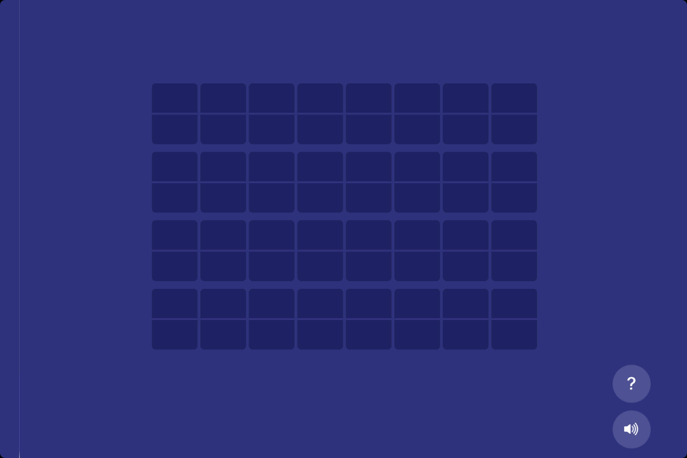

# solari-board

A browser-based animated split-flap (Solari) display — the kind you find in train stations. Built entirely in a single `index.html` with no build tools or dependencies.



## Usage

Download `index.html` and open it in your browser. Control the display entirely through URL parameters.

```
index.html?line1=ZURICH+HB&line2=PLATFORM+7&speed=2
```

## URL Parameters

| Parameter      | Description                                        | Default   |
|----------------|----------------------------------------------------|-----------|
| `line1…lineN`  | Text for each row (auto-truncated/padded to `cols`) | blank    |
| `rows`         | Number of rows                                     | `2`       |
| `cols`         | Characters per row                                 | `20`      |
| `speed`        | Animation speed multiplier (`2` = twice as fast)   | `1`       |
| `background`   | Page background hex color                          | `#2D327D` |
| `charbg`       | Tile background hex color                          | `#1E2260` |
| `char`         | Character color hex                                | `#FFFFFF` |

**Supported characters:** `A–Z`, `0–9`, space, and `. , : / -`
Unsupported characters (e.g. accented letters, `!`, `"`) are replaced with a space.

## Examples

```
# 4-row departure board
index.html?rows=4&cols=20&line1=ZURICH+HB&line2=BERN&line3=DELAYED&line4=SORRY&speed=1.5

# Custom colors (black board, amber text)
index.html?line1=GATE+B7&background=000000&charbg=1a1a1a&char=FF8800

# Fast animation
index.html?line1=HELLO+WORLD&speed=5
```

## Features

- Authentic split-flap flip animation (CSS 3D transforms)
- Random per-tile delays and speeds for a realistic staggered effect
- Click sound on every flip via Web Audio API (muted by default)
- Configurable rows, columns, colors, and speed via URL
- Help popover with all parameters (click the `?` button)
- Single HTML file — no server, no build step, no dependencies

## Media

- `media/solari.gif` — animated demo
- `media/solari.mp4` — video demo
